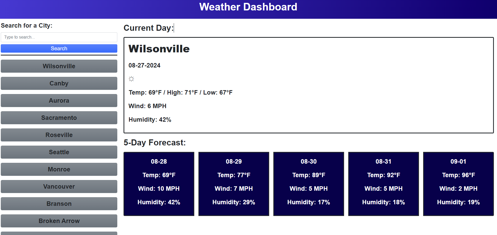

# Weather Dashboard

<strong> Need to plan a get away trip, plan out an outfit, or even check to see how the temps will be throughout your week?  Let this Weather Dashboard be your guide to assist in some planning and decision making on your adventures!  Use this Weather Dashboard to check your local current temp, wind speed, and humidity as well as five days in advance!  Have Fun! </strong>

## How to Use: 

<strong>Click link to launch website in browser.</strong>

[Weather Dashboard](https://xchrisxwilliamsx.github.io/weather-dashboard)

 Upon entering the Weather Dashboard for the first time there really wont be any cities or data populating or saved yet.  In the upper left corner please input a US city of your choosing.  After inputting the city press the button beneath your input field labelled Search.  After pressing the Search button your input will be displayed under the Search button.  These inputted cities are buttons.  Please click your desired city.  After clicking on the city of your choosing you are met with a larger current day weather data card as well as a 5 day forecast under the current day card.  The current day weather card will display the location, date, a day time/night time icon indicator, the current temp as well as the daily high and low, the wind speed, and the humidity.  The 5 day forecast will display their respective dates, the avg temp for the day, avg wind speed, and humidity. 

 Enjoy!

 

<strong>Webpage should function as shown:</strong>

 

## Spot an issue?  Please visit repo (link below) and submit an issue.

[GitHub Repo](https://github.com/xChrisxWilliamsx/weather-dashboard)